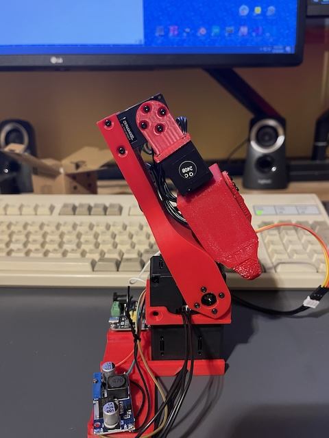

# Imitation Learning w/ iPhone-based Teleoperation of a Low-Cost Robot Arm
*Bart Trzynadlowski, 2024*

## Overview

To learn about how end-to-end neural network-based control of robots works, I built [Alex Koch's low-cost robot arm](https://github.com/AlexanderKoch-Koch/low_cost_robot) and wrote an iPhone-based teleoperation system for data collection. This repository allows you to:

- Teleoperate the robot arm by waving an iPhone around
- Collect demonstrations for training
- Use one or multiple cameras as input
- Train [ACT](https://github.com/tonyzhaozh/act)
- Run the resulting policies

<p align="center">
<br>
<i>The low-cost 4dof arm.</i>
</p>

The project has three components:

- Python-based server for operating the robot, taking camera input, and receiving poses from the iOS app
- ARKit-based iOS app that transmits poses over the network
- ACT training and inference server

## iPhone Teleoperation

Imitation learning involves teleoperating a robot to gather example data of a task. During recording, the camera image (or images if using multiple cameras) and robot actuator angles are captured for each frame. These are then used to train [ACT](https://github.com/tonyzhaozh/act), which takes the current camera frame(s) and actuator angles and predicts the next target actuator angles for several time steps into the future. 

Typically, this is done by puppeteering a simpler "leader" arm whose joint angles are reflected to the "follower" arm. To avoid having to build a second arm, I wrote an iOS app with ARKit to control the end effector (i.e., gripper) pose in real-time. The server receives poses from the iOS app over the network and uses inverse kinematics to figure out how to actuate the servos. ARKit tracks the phone's pose in 6dof space. To record an episode, the *Move* button is pressed, which causes the robot to mirror the phone's motions. Pressing *Stop* or resetting the pose terminates the episode and writes the data to disk.

<p align="center">
<br>
<i>Teleoperating the arm with an iPhone.</i>
</p>

## Usage

### Collecting Data

To discover the serial port on which the robot is connected, run:

```
python -m server --list-serial-ports
```

To run the robot server, specify the serial port the robot is connected to. You may use wildcards, in which case the first matching port will be used. This is useful on macOS, where port names are long and cumbersome.

```
python -m server --serial-port=*usb*
```

The default camera is camera 0. You will need to experiment to figure out which is which on your system. To record episodes to the `cube` directory using camera 1:

```
python -m server --serial-port=*usb* --camera=1 --record-to=cube
```

Now, when moving the arm using the iOS app, episode datasets will be created in that directory. Each episode is written to its own folder as an HDF5 file along with a video recording (not used for training).

```
cube/
  example-0/
    data.hdf5
    video.mp4
  example-1/
    data.hdf5
    video.mp4
  ...
 ```

<p align="center">
<br>
<i>Training episode captured with two cameras.</i>
</p>

To replay an episode to the robot (here assuming Windows and COM4 as the serial port):

```
python -m server --serial-port=COM4 --replay-from=cube/example-0/data.hdf5
```

**Multiple cameras** can be specified using a comma-delimited list:

```
python -m server --serial-port=COM4 --camera=0,1 --record-to=cube_stereo
```

### Training a Policy

Once a few dozen episodes have been collected, a policy can be trained. The [ACT paper](https://arxiv.org/abs/2304.13705) is highly recommended as prerequisite reading material. The model has many parameters but sensible defaults are used here. To train a model on episodes stored in `cube`:

```
python -m act --train --dataset-dir=cube --checkpoint-dir=cube/checkpoints
```

The resulting checkpoints will be output to `cube/checkpoints`. By default, the chunk size is 100. Increasing the batch size (and then lowering the learning rate) can help:

```
python -m act --train --dataset-dir=cube --checkpoint-dir=cube/checkpoints --batch-size=64 --lr=5e-5
```

Check out Tony Zhao's helpful [ACT tuning tips](https://docs.google.com/document/d/1FVIZfoALXg_ZkYKaYVh-qOlaXveq5CtvJHXkY25eYhs/edit?usp=sharing).

### Running the Policy

First, launch the inference server:

```
python -m act --infer --checkpoint-file=cube/checkpoints/policy_best.ckpt
```

Next, run the robot server and instruct it to run in inference mode. It will send frames and actuator values to the inference server and await responses, which it will execute. Assuming the inference server is running on the same machine:

```
python -m server --serial-port=COM4 --infer
```

Otherwise, specify the endpoint explicitly:

```
python -m server --serial-port=COM4 --infer --inference-endpoint=192.168.0.100:8001
```

Make sure to specify the same cameras. For example, if the data was collected using two cameras:

```
python -m server --serial-port=COM4 --infer --camera=0,1
```

<p align="center">
<br>
<i>Robot autonomously grasping an object and placing it in a bin.</i>
</p>

Have fun!
